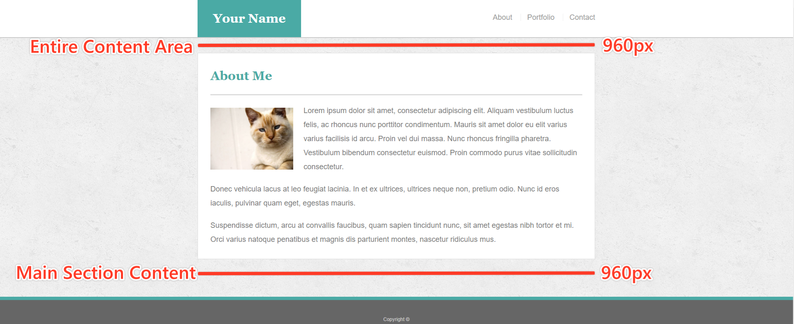

# Build a Portfolio with Raw CSS

## Overview

In this assignment, you'll build a professional portfolio site using HTML/CSS. These instructions include a short style guide; follow it to design an aesthetically pleasing layout while creating different kinds of complex HTML elements. You will be basically building a responsive portfolio with `media-queries`.

### Commits

Having an active and healthy commit history on GitHub is important for your future job search. It is also extremely important for making sure your work is saved in your repository. If something breaks, committing often ensures you are able to go back to a working version of your code.

* Committing often is a signal to employers that you are actively working on your code and learning.

  * We use the mantra “commit early and often.”  This means that when you write code that works, add it and commit it!

  * Numerous commits allow you to see how your app is progressing and give you a point to revert to if anything goes wrong.

* Be clear and descriptive in your commit messaging.

  * When writing a commit message, avoid vague messages like "fixed." Be descriptive so that you and anyone else looking at your repository knows what happened with each commit.

* We would like you to have well over 200 commits by graduation, so commit early and often!

### Instructions

1. Create a new repository in GitHub called `Basic-Portfolio`.

2. Clone this repository to your computer using the process we went over in class.

3. Navigate to the `Basic-Portfolio` folder that you just cloned onto your machine. Inside this folder, create the following:

   * 3 HTML documents: `index.html`, `contact.html` and `portfolio.html`.
   * A folder called `assets`.
   * Inside the assets directory, make two additional folders: `css` and `images`.
     * In the `css` folder, make a file called `style.css`.
     * In the `images` folder, save the images you plan on using (like your profile image and the placeholder images for the portfolio).

4. Push the above changes to GitHub.

   * Make sure to `git add .` and `git commit -m "initial site files"`. Then type `git push origin master` to push your changes to your GitHub repo.

5. Reference these screenshots for your site:

   

   

   

   * **IMPORTANT** Your site's layout must match the designs in these screenshots. You'll find the specs for these designs below.

6. When you create a website, it's standard practice to code your HTML files before writing any CSS and to write up one HTML file before moving onto the next. Write your HTML semantically, too:

   * If something is a heading, you use a heading tag.
   * If something is a list, you use an unordered or ordered list tag.
   * So on and so forth.

7. The content for the `index.html` should be unique to **you**.

   * Write a paragraph or two about yourself. Make it fun, show your personality!
   * The main logo where it says "Your Name" should say your name. This may make the logo section smaller or wider depending on how long your name is—that is fine and expected.
   * Add, commit, and push your code to GitHub often, especially when you complete a page.

8. After all of your HTML is written, you can begin styling your pages using the `style.css` file you created.

   * Be sure to [validate your html](https://validator.w3.org/#validate_by_input).
   * Consult the specs below these instructions for advice on styling your CSS files.

9. Inside your portfolio folder, find your `styles.css` file. You will write your media queries at the bottom of `styles.css`.

10. Use three `@media screen` tags, each with one of these `max-width`s: `980px`, `768px` and `640px`.

   * You use `980px` because you never want any of the content to be cut off. Since the desktop layout is about 960px wide, you want the media queries to kick in before your content gets cut off.

   * `768px` is about the width of a tablet and `640px` is about the width of a phone in landscape.

11. Make the layout match the following screenshots:

   * `index.html`: [980px](Images/980-index.jpg), [768px](Images/768-index.jpg), [640px](Images/640-index.jpg)

   * `portfolio.html`: [980px](Images/980-portfolio.jpg), [768px](Images/768-portfolio.jpg), [640px](Images/640-portfolio.jpg)

   * `contact.html`: [980px](Images/980-contact.jpg), [768px](Images/768-contact.jpg), [640px](Images/640-contact.jpg)

12. Make the position of the header `static` (the default positioning) when the screen is `640px` wide. The header design takes up a lot of room; you don't want it to stick to the top of a small screen and leave no room for the rest of your site.

13. Be sure to include the `viewport` tag in all your HTML files, otherwise your media-queries won't function as expected on mobile devices. _(Hint: You won't need to use exact pixels for anything other than the container)_

14. **Protip**: Use the Chrome extensions [Window Resizer](https://chrome.google.com/webstore/detail/window-resizer/kkelicaakdanhinjdeammmilcgefonfh) and [Browser Width](https://chrome.google.com/webstore/detail/browser-width/mlnegepkjlccabakompdmbcmdieaideh) to see the browser dimensions in Chrome.

15. Deploy your new portfolio (now with media queries!) to GitHub Pages.

### Additional Specifcations

1. Colors _Pro-tip: Use the [Eye Dropper](https://chrome.google.com/webstore/detail/eye-dropper/hmdcmlfkchdmnmnmheododdhjedfccka) Chrome extension to find the colors used on web pages._
   * Teal color (used for headings and backgrounds): `#4aaaa5`
   * Regular font color (used for paragraphs and all text besides the headings): `#777777`
   * Main header background color: `#ffffff`
   * Main header border color: `#cccccc`
   * Footer background color: `#666666`
   * Main content background color: `#ffffff`
   * Main content border color: `#dddddd`

2. Fonts:
   * For heading fonts use `font-family: 'Georgia', Times, Times New Roman, serif;`.
   * For all other fonts use `'Arial', 'Helvetica Neue', Helvetica, sans-serif;`.

3. Profile Image Found on `index.html`:
   * Use a picture of yourself.
   * If you don't have a picture, you can grab a placeholder image from [LoremPixel](http://lorempixel.com/). Save the images to your `images` folder.

4. Portfolio Images:
   * Placeholder images can be found at [LoremPixel](http://lorempixel.com/).
   * Save the images to your `images` folder.

5. Background Images:
   * The background pattern used was found on [Subtle Patterns](https://subtlepatterns.com/). You can browse through that site and find whichever pattern you like.

6. Dimensions:
   * The entire content and the main section content area is `960px` wide.

   

### Bonus

1. Make your pages more sophisticated by adding style to text links, to image links, and to buttons for when a user hovers their cursor over them. A CSS hover tutorial can be found [here](http://www.codeitpretty.com/2013/06/how-to-use-css-hover-effects.html).

2. You can use [Adobe Kuler](https://color.adobe.com/create/color-wheel/) to find colors that match the theme (in this case, the primary color is Teal `#4aaaa5`).

3. Make a "sticky footer." You will notice the dark grey footer will always rest just below the content. This is fine whenever your site has enough content to push it down past the height of most monitors. But if there isn't much content in the body, the footer could rest in the middle of the page:
   * Try to code the footer in a way that it will always remain at the bottom of the page, no matter how short the content is. A sticky footer tutorial can be found [here](https://css-tricks.com/couple-takes-sticky-footer/).
   * Give the Footer the following CSS:
   * border-top: 8px solid #4aaaa5;

### Helpful Hints

* For help with Git and GitHub, be sure to consult the GitHub Supplemental Guide sent to you in class.

* Don't forget to look into these concepts: `float`, `padding`, `margin`, `display`, `overflow`, `clear` and `text-align`.

* This will be a tough assignment, but towards the end of the course, you'll look back to this exercise and realize just how much you've grown as a developer. Stay positive! You've got this!

**Good Luck!**
