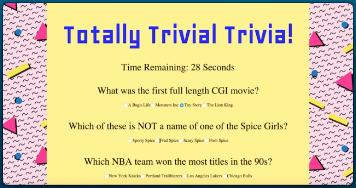

# Timers

### Overview

In this assignment, You'll create a Trivia game using JavaScript for the logic and jQuery to manipulate HTML. Be sure to layout this app with valid HTML and stylish CSS.

### Commits

Having an active and healthy commit history on GitHub is important for your future job search. It is also extremely important for making sure your work is saved in your repository. If something breaks, committing often ensures you are able to go back to a working version of your code.

* Committing often is a signal to employers that you are actively working on your code and learning.

  * We use the mantra “commit early and often.”  This means that when you write code that works, add it and commit it!

  * Numerous commits allow you to see how your app is progressing and give you a point to revert to if anything goes wrong.

* Be clear and descriptive in your commit messaging.

  * When writing a commit message, avoid vague messages like "fixed." Be descriptive so that you and anyone else looking at your repository knows what happened with each commit.

* Commit early and often

### Basic Quiz (Timed Form)

**[Click Here to Watch the Demo](https://youtu.be/fBIj8YsA9dk)**.

* You'll create a trivia form with multiple choice or true/false options (your choice).

* The player will have a limited amount of time to finish the quiz. 

  * The game ends when the time runs out. The page will reveal the number of questions that players answer correctly and incorrectly.

* Don't let the player pick more than one answer per question.

* Don't forget to include a countdown timer.

  **Good Luck!**
