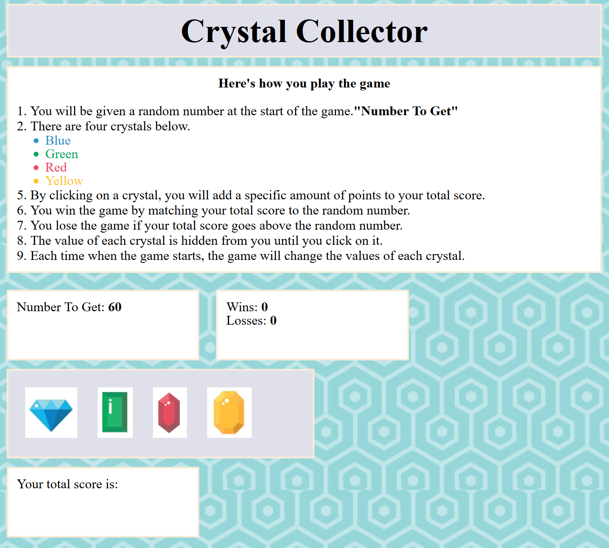

## Summary
​
Build the `Crystal Collector` game with React
​
**General Layout**

* Have a `header` component for the heading
* A `detail` component to specify the rules of the game
* `Display-Random` component that displays the number of crystals to collect
* `Score` component to display the score
* `Crystal` component to display four crystals with specfic on click event listeners

**Suggested Simple design**

Be creative in your design layout!

**Good Luck!**