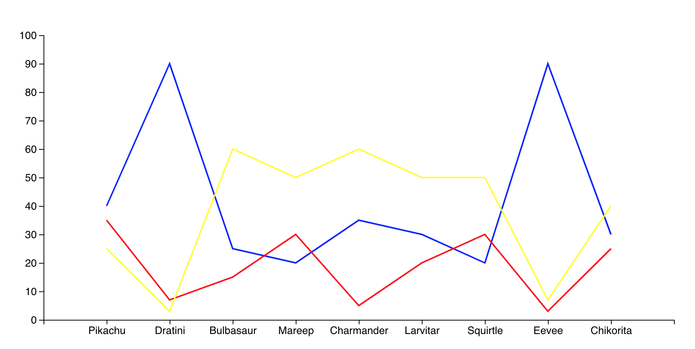

# Pokemon Go - Team Activity

Team rivalries run rampant in Pokemon Go. Are you Team Mystic? Valor, or Instinct? These teams often compete against each other to catch the most Pokemon possible. In the provided csv, data was collected based on the percentage of each team's overall activity on given Pokemon Community Days. 

For example, on Pikachu's Community Day, Team Mystic caught 40% of all Pikachus during the event with Valor trailing not far behind at 35% and Instinct at 25%.

Using `d3` and the provided files, your task is to create a line graph that displays each teams' percentage of activity throughout all past community days. Your finished product should look something like this

Instructions are included within the unsolved `app.js` file. Good luck trainers! And Team Mystic all the way!!!!
