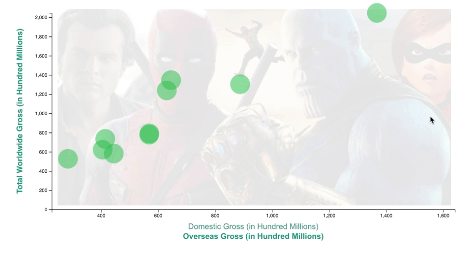

# Box Office Success!

2018 has been a great year for the film industry with a series of record breaking opening and worldwide grosses. This summer `Avengers: Infinity War` became just the 4th film in history to pass $2 billion in total gross. `The Incredibles 2` broke numerous opening week records for an animated film, and `Black Panther` became the 3rd film in US history to pass 700 million domestically.

Using D3, let's create an interactive graph of the top 10 highest grossing films of 2018. The given csv files has the total gross, total domestic gross, and total overseas gross of each film (in hundreds of millions).

Follow the instructions within the unsolved folder to create this visualization:

## Hints

If you are finding yourself getting stuck or don't know where to start look into D3 activity `12-Par_Hair_Metal_Conclusion` for some guidance