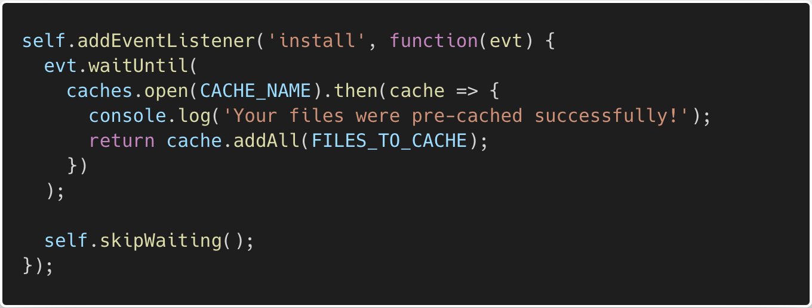
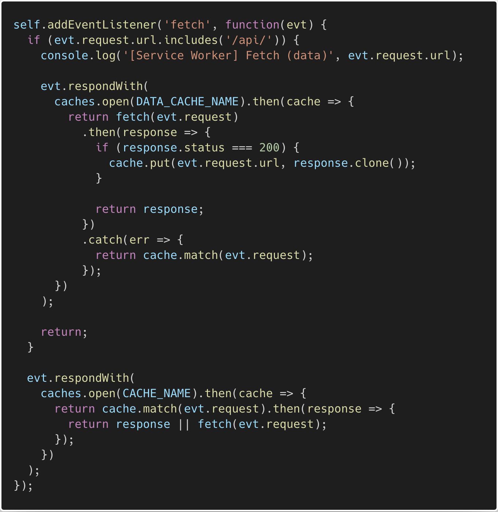

# The Offline Experience

In this activity you will be enabling functionality to allow your application to work offline.

## Instructions

* Add the following code to your `service-worker.js` file.

* Type out the following code snippets when adding them to your application, it will help you solidify what you are doing!

* As you go through each step, keep your Chrome Develop tools open to monitor your progress and debug if needed.

   1. Set Up Cache Files

   

   2. Install and Register Your Service Worker

   

   3. If done successfully, you should see your static cache in your Application tab.

   

   4. Activate Service Worker

   

   5. Fetch Files

   

   If done successfully you will see your data cache in your Application tab. At this point you should be able to put your application in offline mode for an offline experience.

   

   
